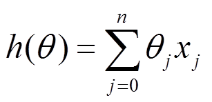
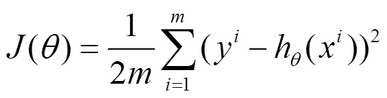
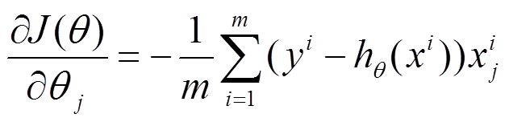
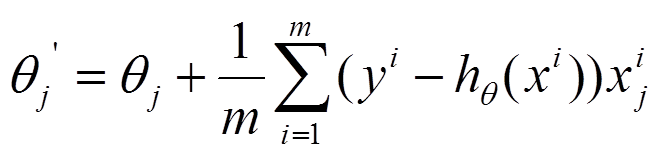
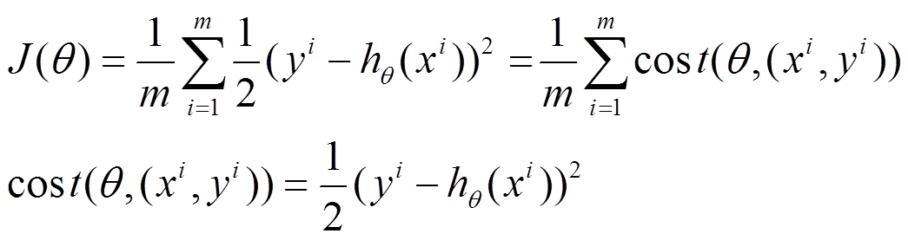
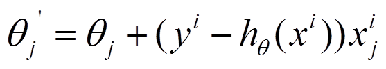

# 数据预处理
1. 当feature中有string类型时，可以使用**simple encoding**方式添加**dummy coefficients**。具体请参考[linregr-categorical-features](https://turi.com/learn/userguide/supervised-learning/linear-regression.html#linregr-categorical-features).

# 优化方法
## Gradient Descent
比如对一个线性回归（Linear Logistics）模型，假设下面的h(x)是要拟合的函数，J(theta)为损失函数，theta是参数，要迭代求解的值，theta求解出来了那最终要拟合的函数h(theta)就出来了。其中m是训练集的样本个数，n是特征的个数。

### Batch Gradient Descent，BGD
（1）将J(theta)对theta求偏导，得到每个theta对应的的梯度：

（2）由于是要最小化风险函数，所以按每个参数theta的梯度负方向，来更新每个theta：

（3）从上面公式可以注意到，**它得到的是一个全局最优解，但是每迭代一步，都要用到训练集所有的数据**，如果m很大，那么可想而知这种方法的迭代速度会相当的慢。所以，这就引入了另外一种方法——随机梯度下降。

对于批量梯度下降法，样本个数m，x为n维向量，一次迭代需要把m个样本全部带入计算，迭代一次计算量为m*n^2。

### Mini-Batch Gradient Descend, MBGD
### Stochastic Gradient Descent，SGD
（1）上面的风险函数可以写成如下这种形式，损失函数对应的是训练集中每个样本的粒度，而上面批量梯度下降对应的是所有的训练样本：

（2）每个样本的损失函数，对theta求偏导得到对应梯度，来更新theta：

（3）随机梯度下降是通过**每个样本**来迭代更新一次，如果样本量很大的情况（例如几十万），那么可能只用其中几万条或者几千条的样本，就已经将theta迭代到最优解了，对比上面的批量梯度下降，迭代一次需要用到十几万训练样本，一次迭代不可能最优，如果迭代10次的话就需要遍历训练样本10次。但是，**SGD伴随的一个问题是噪音较BGD要多，使得SGD并不是每次迭代都向着整体最优化方向**。

随机梯度下降每次迭代只使用一个样本，迭代一次计算量为n^2，当样本个数m很大的时候，随机梯度下降迭代一次的速度要远高于批量梯度下降方法。两者的关系可以这样理解：随机梯度下降方法以损失很小的一部分精确度和增加一定数量的迭代次数为代价，换取了总体的优化效率的提升。增加的迭代次数远远小于样本的数量。

**对批量梯度下降法和随机梯度下降法的总结**

批量梯度下降---最小化所有训练样本的损失函数，使得最终求解的是全局的最优解，即求解的参数是使得风险函数最小，但是对于大规模样本问题效率低下。

随机梯度下降---最小化每条样本的损失函数，虽然不是每次迭代得到的损失函数都向着全局最优方向，但是大的整体的方向是向全局最优解的，最终的结果往往是在全局最优解附近，适用于大规模训练样本情况。

相关阅读

* [常见的几种最优化方法（梯度下降法、牛顿法、拟牛顿法、共轭梯度法等）](https://www.cnblogs.com/shixiangwan/p/7532830.html)
* [深度学习—加快梯度下降收敛速度（一）：mini-batch、Stochastic gradient descent](https://blog.csdn.net/hdg34jk/article/details/78864070)