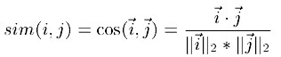
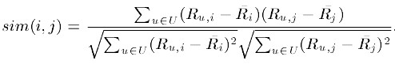
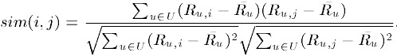
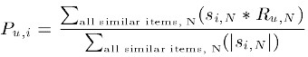

# Paper-of-Recommendation-System
# 推荐系统综述型博客&论文
* [推荐算法综述](https://blog.csdn.net/u013709270/article/details/78629133)
# 协同过滤
基于协同过滤的推荐系统一般应用于有**用户评分**的系统之中，通过分数去刻画用户对于物品的喜好。协同过滤被视为利用集体智慧的典范，不需要对项目进行特殊处理，而是通过用户建立物品与物品之间的联系。

用户评分是基于协同过滤的推荐系统的基础，它的获取可以是

* 用户的直接打分，比如电影评分、商品评分等；
* 由购买记录、历史记录计算出来；
* 数据挖掘等。

目前，协同过滤推荐系统被分化为两种类型：基于用户(User-based)的推荐和基于物品(Item-based)的推荐。

## User-based algorithms
思想：某个用户对所有商品的评分构成一个评分向量。通过计算active user与其它用户的相似度，可以获得active user的neibours，neibours购买的，但active user没有购买的商品就是active user潜在的推荐商品，然后计算active user在潜在推荐商品上的评分，选择top-N商品推荐给active user。

存在的问题

* **数据稀疏性**。一个大型的电子商务推荐系统一般有非常多的物品，用户可能买的其中不到1%的物品，不同用户之间买的物品重叠性较低，导致算法无法找到一个用户的邻居，即偏好相似的用户。（论文原文：In practice, many commercial recommender systems are used to evaluate large item sets (e.g., Amazon.com recommends books and CDnow.com recommends music albums). In these systems, even active
users may have purchased well under 1% of the items (1% of 2 million books is 20; 000 books). Accordingly,
a recommender system based on nearest neighbor algorithms may be unable to make any item recommendations for a particular user. As a result the accuracy of recommendations may be poor.）
* **算法扩展性**。最近邻居算法的计算量随着用户和物品数量的增加而增加，不适合数据量大的情况使用。（论文原文：Nearest neighbor algorithms require computation that grows with both the number of users and the number of items. With millions of users and items, a typical web-based recommender system running existing algorithms will suffer serious scalability
problems.）

## Item-based algorithms
基本思想是预先根据所有用户的历史偏好数据计算物品之间的相似性，然后把与用户喜欢的物品相类似的物品推荐给用户。**因为物品直接的相似性相对比较固定，所以可以预先在线下计算好不同物品之间的相似度，把结果存在表中，当推荐时进行查表，计算用户可能的打分值，可以同时解决user-baed算法中存在的两个问题**。

### 《Item-Based Collaborative Filtering Recommendation Algorithms》

影响最广的，被引用的次数也最多的一篇推荐系统论文。文章很长，非常详细地探讨了基于Item-based 方法的协同过滤，作为开山之作，大体内容都是很基础的知识。

文章把Item-based算法分为两步：

* 相似度计算，得到各item之间的相似度
	* 基于余弦（Cosine-based）的相似度计算
	
		
	* 基于关联（Correlation-based）的相似度计算
	
		
	* 调整的余弦（Adjusted Cosine）相似度计算
	
		
* 预测值计算，对用户未打分的物品进行预测
	* 加权求和。用户u已打分的物品的分数进行加权求和，权值为各个物品与物品i的相似度，然后对所有物品相似度的和求平均，计算得到用户u对物品i打分。
	
		
	* 回归。如果两个用户都喜欢一样的物品，因为打分习惯不同，他们的欧式距离可能比较远，但他们应该有较高的相似度 。在通过用线性回归的方式重新估算一个新的R(u,N).
	
		

备注：
在该论文中，作者把user-based CF归类为Memory-based algorithms，把item-based CF归类为Model-based algorithms。但是目前是将user-based CF和item-based CF都归类为Memory-based algorithms。

相关阅读：

* [基于物品的协同过滤推荐算法——读“Item-Based Collaborative Filtering Recommendation Algorithms”](https://blog.csdn.net/huagong_adu/article/details/7362908)
* [推荐算法综述2--协同过滤CF](https://blog.csdn.net/u010297828/article/details/51504952)

