# Paper-of-Recommendation-System
推荐系统的研究从上世纪90年代初发展至今，目前有三大主流算法作为几乎全部的推荐算法的基石，它们就是基于内容的过滤算法（content-based filtering，简称CBF）、邻域算法（neighborhood methods）、隐语义模型（latent factor models，简称LFM），其中后两者统称为协同过滤算法（collaborative filtering，简CF）。下面是三者的关系示意图：
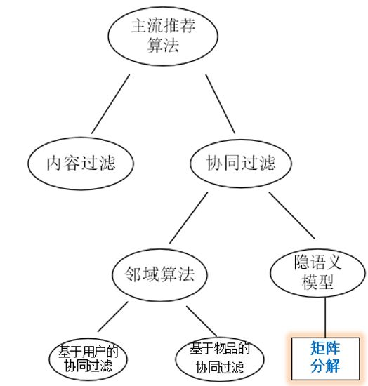

CBF通过给用户、物品定义显式的属性（通常会找所涉及的推荐领域的人类专家来定义）来描述他们的本质，然后为用户推荐与他们本质“门当户对”的物品；CF则是通过发动“群体的力量”，从其他用户、物品中学习到宝贵的信息，无需显式地定义属性：CF下的邻域算法着重于学习用户与用户、物品与物品之间的关系，为目标用户推荐与目标用户相似的用户所选择的物品（user-based）或者与目标用户所选择的物品相似的物品（item-based）；CF下的隐语义模型则是通过学习用户与用户、物品与物品之间的关系来自动获得用户、物品的隐属性（这里的“隐”指的是学习到的属性是不可解释的），相当于把用户-评分矩阵分解成用户隐属性矩阵和物品隐属性矩阵，然后通过用户隐属性向量u与物品隐属性向量i作点乘来获取到该用户对该物品的评分，以此为依据进行推荐。

详细请参考知乎专栏：[论文篇：Matrix Factorization Techniques for RS](https://zhuanlan.zhihu.com/p/28577447)

# 推荐系统综述型博客&论文
* [推荐算法综述](https://blog.csdn.net/u013709270/article/details/78629133)
# 协同过滤
基于协同过滤的推荐系统一般应用于有**用户评分**的系统之中，通过分数去刻画用户对于物品的喜好。协同过滤被视为利用集体智慧的典范，不需要对项目进行特殊处理，而是通过用户建立物品与物品之间的联系。

用户评分是基于协同过滤的推荐系统的基础，它的获取可以是

* 用户的直接打分，比如电影评分、商品评分等；
* 由购买记录、历史记录计算出来；
* 数据挖掘等。

目前，协同过滤推荐系统被分化为两种类型：基于用户(User-based)的推荐和基于物品(Item-based)的推荐。

## User-based algorithms
思想：某个用户对所有商品的评分构成一个评分向量。通过计算active user与其它用户的相似度，可以获得active user的neibours，neibours购买的，但active user没有购买的商品就是active user潜在的推荐商品，然后计算active user在潜在推荐商品上的评分，选择top-N商品推荐给active user。

存在的问题

* **数据稀疏性**。一个大型的电子商务推荐系统一般有非常多的物品，用户可能买的其中不到1%的物品，不同用户之间买的物品重叠性较低，导致算法无法找到一个用户的邻居，即偏好相似的用户。（论文原文：In practice, many commercial recommender systems are used to evaluate large item sets (e.g., Amazon.com recommends books and CDnow.com recommends music albums). In these systems, even active
users may have purchased well under 1% of the items (1% of 2 million books is 20; 000 books). Accordingly,
a recommender system based on nearest neighbor algorithms may be unable to make any item recommendations for a particular user. As a result the accuracy of recommendations may be poor.）
* **算法扩展性**。最近邻居算法的计算量随着用户和物品数量的增加而增加，不适合数据量大的情况使用。（论文原文：Nearest neighbor algorithms require computation that grows with both the number of users and the number of items. With millions of users and items, a typical web-based recommender system running existing algorithms will suffer serious scalability
problems.）

## Item-based algorithms
基本思想是预先根据所有用户的历史偏好数据计算物品之间的相似性，然后把与用户喜欢的物品相类似的物品推荐给用户。**因为物品直接的相似性相对比较固定，所以可以预先在线下计算好不同物品之间的相似度，把结果存在表中，当推荐时进行查表，计算用户可能的打分值，可以同时解决user-baed算法中存在的两个问题**。

### *Item-Based Collaborative Filtering Recommendation Algorithms*

影响最广的，被引用的次数也最多的一篇推荐系统论文。文章很长，非常详细地探讨了基于Item-based 方法的协同过滤，作为开山之作，大体内容都是很基础的知识。

文章把Item-based算法分为两步：

* 相似度计算，得到各item之间的相似度
	* 基于余弦（Cosine-based）的相似度计算

		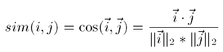
	* 基于关联（Correlation-based）的相似度计算

		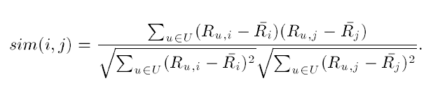
	* 调整的余弦（Adjusted Cosine）相似度计算

		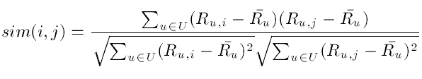
* 预测值计算，对用户未打分的物品进行预测
	* 加权求和。用户u已打分的物品的分数进行加权求和，权值为各个物品与物品i的相似度，然后对所有物品相似度的和求平均，计算得到用户u对物品i打分。

		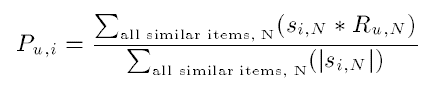
	* 回归。如果两个用户都喜欢一样的物品，因为打分习惯不同，他们的欧式距离可能比较远，但他们应该有较高的相似度 。在通过用线性回归的方式重新估算一个新的R(u,N).

		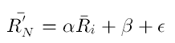

备注：
在该论文中，作者把user-based CF归类为Memory-based algorithms，把item-based CF归类为Model-based algorithms。但是目前是将user-based CF和item-based CF都归类为Memory-based algorithms。

## 协同过滤的特点
1. 存在冷启动问题 - cold start problem（在论文*Matrix Factorization Techniques for Recommender Systems*中提到了，对于这个问题，论文倾向于使用content filtering）

相关阅读：

* [基于物品的协同过滤推荐算法——读“Item-Based Collaborative Filtering Recommendation Algorithms”](https://blog.csdn.net/huagong_adu/article/details/7362908)
* [推荐算法综述2--协同过滤CF](https://blog.csdn.net/u010297828/article/details/51504952)
* [【每周一文】Factorization Machines](https://blog.csdn.net/fangqingan_java/article/details/50677340)

# 矩阵分解
矩阵分解是构建隐语义模型的主要方法，即通过把整理、提取好的“用户—物品”评分矩阵进行分解，来得到一个用户隐向量矩阵和一个物品隐向量矩阵。与user-based CF、item-based CF相比，矩阵分解更好地考虑了用户和物品之间的交互信息，具有线下进行、推荐准确率稳定等优点，然而，作为协同过滤算法的一种，它也会遇到**冷启动**的问题。
## *Matrix Factorization Techniques for Recommender Systems*
推荐系统领域里非常经典、频繁被引用的论文。

这个论文是推荐系统领域第一篇比较正式、全面介绍融合了机器学习技术的矩阵分解算法（区别于传统的SVD矩阵分解）。矩阵分解是构建隐语义模型的主要方法，即通过把整理、提取好的“用户—物品”评分矩阵进行分解，来得到一个用户隐向量矩阵和一个物品隐向量矩阵。

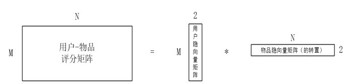

在得到用户隐向量和物品隐向量（如都是2维向量）之后，我们可以将每个用户、物品对应的二维隐向量看作是一个坐标，将其画在坐标轴上。虽然我们得到的是不可解释的隐向量，但是可以为其赋予一定的意义来帮助我们理解这个分解结果。比如我们把用户、物品的2维的隐向量赋予严肃文学（Serious）vs.消遣文学（Escapist）、针对男性（Geared towards males）vs.针对女性（Geared towards females），那么可以形成论文中那样的可视化图片：

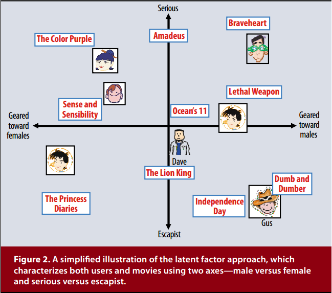

这种矩阵分解方法区别于传统的SVD，这种方法不仅不需要进行缺失值填补，而且相比于线性代数里的奇异值分解，该方法从问题的描述上就是一个最优化问题。给出目标损失函数，然后优化它。所以已经和SVD没什么关系了。

矩阵分解算法具有的融合多种信息的特点也让算法设计者可以从隐式反馈、社交网络、评论文本、时间因素等多方面来弥补显示反馈信息不足造成的缺陷，可以根据需要很容易的把公式进行改变。比如考虑到时间变化的用户、项目的偏差，可以对预测评分函数改写成：

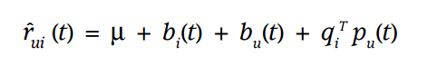

矩阵分解的另外一个特点是可以融合explicit feedback和implicit feedback信息。一般来讲，explicit feedback中的评分矩阵是稀疏矩阵，而implicit feedback信息可从用户行为中获取，包括购买历史记录、搜索记录，甚至鼠标移动。因此implicit feedback信息是稠密矩阵。

相关阅读：

* [论文篇：Matrix Factorization Techniques for RS](https://zhuanlan.zhihu.com/p/28577447)
* [矩阵分解（MATRIX FACTORIZATION）在推荐系统中的应用](https://blog.csdn.net/houlaizhexq/article/details/39998135)

# Click-Through-Ratio Estimation
## *Factorization Machines*
因子分解机(Factorization Machine, FM)是由Steffen Rendle提出的一种基于矩阵分解的机器学习算法。注意，此处的矩阵分解不是矩阵论里讲的奇异值分解之类的。

在进行特征组合的时候，随着阶数的提高，样本会非常稀疏，而且额外引入的参数呈指数增长。比如，当组合的特征个数为2时，复杂度为O(n^3)，通过矩阵分解，可将复杂度降为O(kn^2)，再通过因子分解，可将复杂度降为O(kn)。用梯度下降法进行训练时，求导的复杂度为O(1)，因为求导时所需要的参数都已经在O(kn)的计算过程中计算出来了，因此此处不需要重新计算（论文的III-C有分析）。

FM可以应用的场景非常多，比如

* Regerssion
* Binary Classification
* Ranking

在以上场景中，通常使用L2正则项以防过拟合。

### FM与SVM的对比
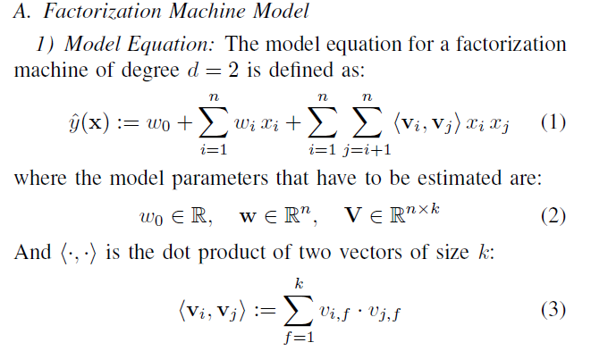

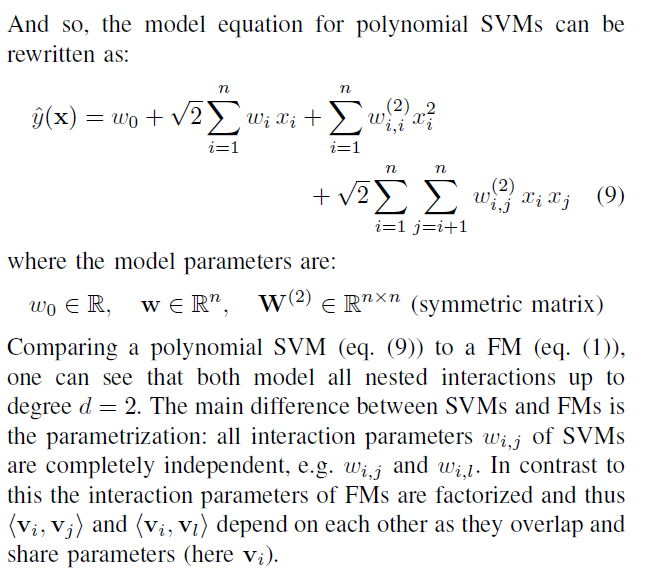

主要的区别就是FM的参数不是独立的，在不同实体上可以共享，而SVM中的参数是独立的，不可共享的。

在稀疏条件下，SVM失败的原因为（详细请查看论文Section IV-B）

* 对于线性SVM，其可以正常工作，但是预测结果很差；
* 对于多项式SVM（以二次多项式为例），其可以获得二次交叉项的偏置，但是由于数据的稀疏性，导致该偏置在测试集中找不到对应的观察项，所以该偏置也就派不上用场了。因此多项式SVM并不比线性SVM性能好。

**FM优势**

* 在非常稀疏的数据中也能工作良好，而SVM, Poly2无法正常工作（详细解释：参考论文*Field-aware Factorization Machines for CTR Prediction* Section 2 POLY2 AND FM）；
* 拥有线性复杂度O(kn)；
* 对所有的实数特征向量都可以工作，而某些算法对输入的数据有严格的限制。

相关阅读：

* [简单易学的机器学习算法——因子分解机(Factorization Machine)](https://blog.csdn.net/google19890102/article/details/45532745)
* [FM在特征组合中的应用](https://www.cnblogs.com/zhangchaoyang/articles/7897085.html)
* [FM与LR的区别 - 参考@白刚的回答](https://www.zhihu.com/question/27043630)
## *Field-aware Factorization Machines* (FFM)
相关阅读：

* [FFM原理及公式推导](http://www.cnblogs.com/zhangchaoyang/articles/8157893.html)

# Click-Through-Ratio Prediction
CTR预估在在线广告中具有非常重要的地位。它对竞价和流量分配中起着重要作用。

相关阅读：

* [A collection of research and survey papers of real-time bidding (RTB) based display advertising techniques.](https://github.com/wnzhang/rtb-papers/)
* [广告ctr预估有什么值得推荐的论文？ - 看王喆的回答](https://www.zhihu.com/question/26154847)
* [CTR预估的几种方式](https://blog.csdn.net/DanyHgc/article/details/78776558)

# GBDT XGBOOST

# Reference
1. [Turi Machine Learning Platform User Guide](https://turi.com/learn/userguide/supervised-learning/classifier.html)
